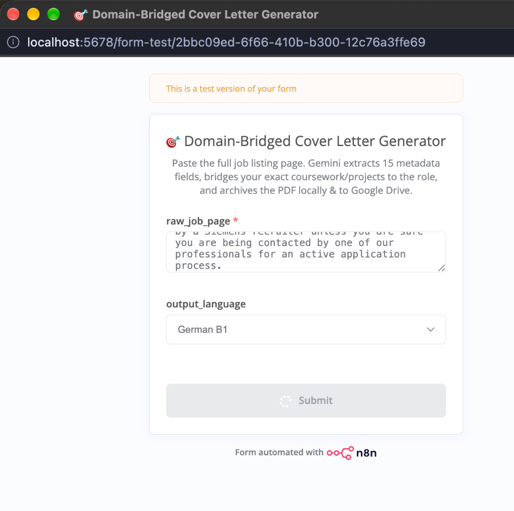
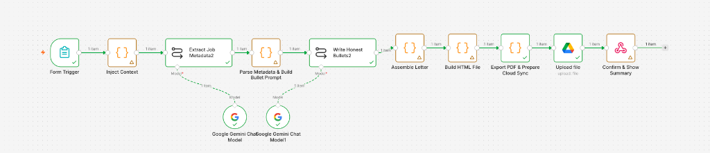

# 🚀 Agentic Cover Letter Generation Pipeline

An end-to-end, zero-hallucination automation pipeline built with **n8n**, **JavaScript**, and the **Gemini 2.5 Flash API**. 

This system takes a raw, unstructured Job Description (JD) dump as input, structurally extracts 15+ metadata fields, and programmatically bridges my verified engineering experience (React Native, FastAPI, AI orchestration) to the exact requirements of the role. It then automatically renders and archives a perfectly formatted, print-ready PDF using a headless browser.

## 🧠 System Architecture

*The pipeline entrypoint: A simple web form that accepts unstructured Job Description dumps and language preferences.*

*The n8n orchestration workflow mapping the constraints and generation.*

The pipeline uses a **constrained-generation architecture** to prevent LLM hallucinations. Instead of allowing the LLM to invent qualifications, the system forces the LLM to select from a hardcoded "Candidate Arsenal" (a JSON array of my verified projects and skills) and map them mathematically to the extracted JD requirements.

### Workflow Nodes

1. **Webhook / Form Trigger:** Accepts raw JD text and target language (German B1 / English C1).
2. **Context Injection (JS):** Injects the hardcoded Candidate Arsenal and strict anti-hallucination rules.
3. **LLM Extraction Engine:** Gemini 2.5 parses the unstructured text into a strict JSON schema (Company, Role, Recruiter Name, Tech Stack, Domain Function).
4. **Bridge Mapping Logic (JS):** Evaluates the extracted metadata and constructs a highly constrained prompt for Stage 5.
5. **LLM Content Generation:** Gemini writes 3 highly targeted bullet points connecting my specific backend/frontend/AI experience to the role's day-to-day function.
6. **HTML Assembly (JS):** Compiles the extracted metadata, LLM bullets, and localized greeting logic into a responsive HTML document (DIN 5008 standard).
7. **Headless PDF Export (Shell):** Executes `child_process.execSync` to run Microsoft Edge in `--headless=new` mode, bypassing default headers/footers to render a pixel-perfect PDF.
8. **Local & Cloud Sync:** Automatically creates hierarchical directories (`~/Documents/n8n/companies/{CompanyName}/{RoleType}`) and passes binary buffers for optional cloud upload.

## 🛠️ Tech Stack
* **Orchestration:** n8n (Local Deployment)
* **LLM Provider:** Google Gemini 2.5 Flash (LangChain Integration)
* **Scripting:** Node.js / JavaScript (Data transformation, regex parsing)
* **Rendering:** Headless Chromium / Edge (`--print-to-pdf`)
* **Data Structures:** JSON

## 💡 Why I Built This
As part of my Master's research in *International Information Systems (Wirtschaftsinformatik)* at FAU, I analyze the "Productivity Paradox of Generative AI." I built this pipeline to demonstrate how constraining probabilistic LLMs with deterministic code (JavaScript/n8n) yields highly reliable, production-ready enterprise automation.
